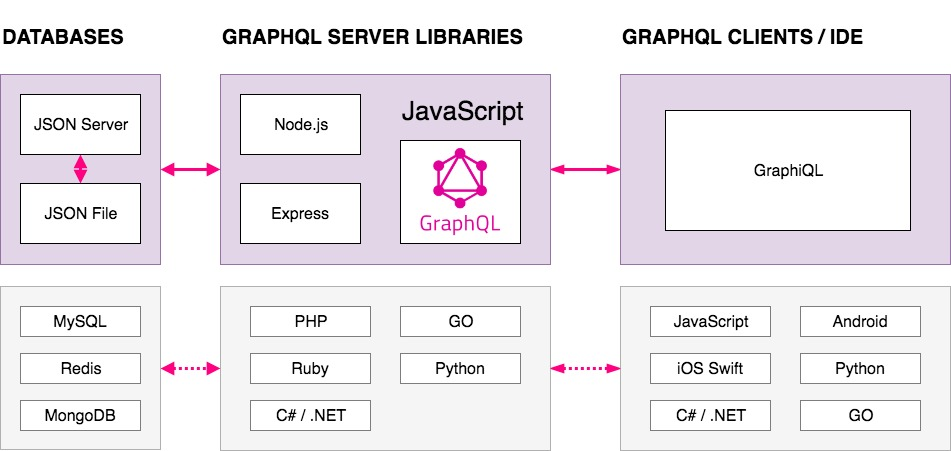
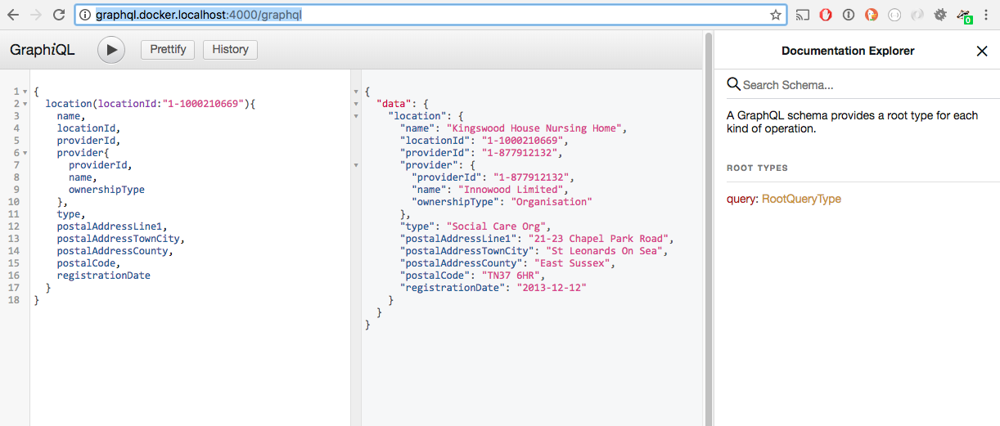

# CQC GraphQL API
**Proof Of Concept** implementing GraphQL API for publicly available data from Care Quality Comission. All data used for this demo was made available from CQC's public API at:
- https://www.cqc.org.uk/about-us/transparency/using-cqc-data



## What is GraphQL
TODO

## Why GraphQL
TODO

## Install Instructions
### How to install POC
Git clone
```
git clone https://github.com/dakkusingh/cqc-graphql-api
cd cqc-graphql-api
```

```
docker-compose up --build

Creating network "graphqlexample_default" with the default driver
Building graphql
Step 1/5 : FROM node:8
---> 4635bc7d130c
Step 2/5 : ENV HOME=/home/graphql
---> Using cache
---> 65e0f6583270
Step 3/5 : WORKDIR $HOME
---> Using cache
---> caecc28cd35c
Step 4/5 : COPY package.json package-lock.json $HOME/
---> Using cache
---> 4d0155825bd1
Step 5/5 : RUN npm install
---> Using cache
---> 4875b4a033fc
Successfully built 4875b4a033fc
Successfully tagged graphqlexample_graphql:latest
Creating graphqlexample_graphql_1 ... done
Attaching to graphqlexample_graphql_1
graphql_1  |
graphql_1  | > cqc-graphql-api@1.0.0 json:server /home/graphql
graphql_1  | > json-server --watch data.json
graphql_1  |
graphql_1  |
graphql_1  | > cqc-graphql-api@1.0.0 dev:server /home/graphql
graphql_1  | > nodemon server.js
graphql_1  |
graphql_1  | [nodemon] 1.17.3
graphql_1  | [nodemon] to restart at any time, enter `rs`
graphql_1  | [nodemon] watching: *.*
graphql_1  | [nodemon] starting `node server.js`
graphql_1  |
graphql_1  |   \{^_^}/ hi!
graphql_1  |
graphql_1  |   Loading data.json
graphql_1  |   Done
graphql_1  |
graphql_1  |   Resources
graphql_1  |   http://localhost:3000/providers
graphql_1  |   http://localhost:3000/locations
graphql_1  |
graphql_1  |   Home
graphql_1  |   http://localhost:3000
graphql_1  |
graphql_1  |   Type s + enter at any time to create a snapshot of the database
graphql_1  |   Watching...
graphql_1  |
graphql_1  | Server is running on port 4000..
```

### GraphiQL
GraphiQL should now be running on port 4000.
you can access the graphiql interface at:

http://graphql.docker.localhost:4000/graphql



## GraphQL Queries

### Specific Location with Provider Data

Show
- User defined fields for locations
- User defined fields for providers

Example GraphQL Query.
```
{
  location(locationId:"1-1000210669"){
    name,
    locationId,
    providerId,
    provider{
      providerId,
      name,
      ownershipType
    },
    type,
    postalAddressLine1,
    postalAddressTownCity,
    postalAddressCounty,
    postalCode,    
    registrationDate
  }
}
```

### All Locations

Show
- Location ID
- Location name

Example GraphQL Query.
```
{
  locations{
    locationId,
    name
  }
}
```

### Specific Location

Show
- User defined fields

Example GraphQL Query.
```
{
  location(locationId:"1-1000210669"){
    name,
    locationId,
    providerId,
    type,
    postalAddressLine1,
    postalAddressTownCity,
    postalAddressCounty,
    postalCode,    
    registrationDate
  }
}
```


### All Providers

Show
- Provider ID
- Provider name

Example GraphQL Query.
```
{
  providers{
    providerId,
    name
  }
}
```

### Specific Provider

Show
- User defined fields for provider

Example GraphQL Query.
```
{
  provider(providerId:"1-189974057"){
    name,
    locationIds,
    providerId
  }
}
```
